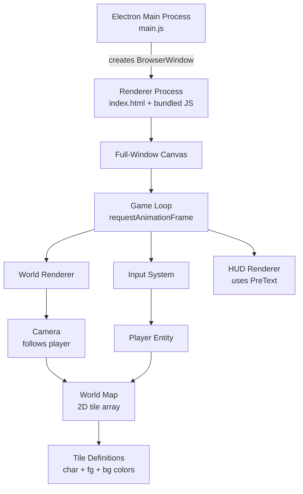

# Text Game Scaffold with PreText + Electron

## Tech Stack

- **Electron** -- application window, no frame decorations needed
- **@chenglou/pretext** -- DOM-free text measurement and layout (for HUD/dialog text)
- **Canvas 2D API** -- all rendering goes through a single full-window `<canvas>`
- **Vite** -- bundles the renderer process code (handles npm imports cleanly)
- No frameworks, no DOM manipulation at runtime

## Architecture



## Project Structure

```
textgame/
  package.json
  vite.config.js
  main.js              # Electron main process
  index.html           # Minimal shell: just a <canvas>
  src/
    index.js           # Renderer entry: boot game loop
    renderer.js        # Canvas rendering engine (grid + PreText UI)
    input.js           # Keyboard state tracking (8-dir movement)
    camera.js          # Viewport that follows the player
    world.js           # World map storage + procedural generation
    tiles.js           # Tile catalog: character, fg color, bg color
    player.js          # Player entity (@)
    entities.js        # NPCs, signs, chests, etc.
    hud.js             # HUD overlay rendered via PreText
```

## Key Design Decisions

### Rendering approach

- Use a **monospace font** (`"Courier New", monospace`) so every tile cell is the same pixel width.
- Measure one character's width and height at startup using `canvas.measureText()` to determine the cell size.
- Render the game grid **row by row** using `ctx.fillText()` -- each visible row is a string composed from the tile map, drawn in one call per color group.
- Use **PreText** (`prepareWithSegments` + `layoutWithLines`) for all UI text that needs wrapping: dialog boxes, item descriptions, help text. This keeps the DOM completely out of the picture.

### Resize handling

- The `<canvas>` is styled to fill the window (`width: 100vw; height: 100vh`) with no margin/padding.
- On `resize`, recalculate `canvas.width` / `canvas.height` to match `window.innerWidth` / `window.innerHeight` (accounting for `devicePixelRatio`).
- Recompute the visible grid dimensions: `cols = floor(canvasWidth / cellWidth)`, `rows = floor(canvasHeight / cellHeight)`.
- The game loop already re-renders every frame, so the next frame naturally uses the new dimensions. No layout thrashing.

### World generation

- A simple procedural map (~200x200 tiles) using noise-like patterns:
  - Grass plains (`.` green), dense forest (`♠` dark green), water (`~` blue), stone paths (`░` tan), mountains (`▲` gray), flowers (`✿` magenta/yellow).
- A few hand-placed structures using box-drawing characters (`═║╔╗╚╝╠╣╦╩`) for buildings.
- Collision flags per tile type (water and mountains block movement, everything else is walkable).

### Tile definitions ([`src/tiles.js`](src/tiles.js))

Each tile type is an object: `{ char, fg, bg, solid }`. Example:

```js
GRASS:    { char: '·', fg: '#4a7c3f', bg: '#1a2e15', solid: false }
TREE:     { char: '♠', fg: '#2d5a1e', bg: '#1a2e15', solid: true }
WATER:    { char: '~', fg: '#4a8fe7', bg: '#0f2a4a', solid: true }
MOUNTAIN: { char: '▲', fg: '#8a8a8a', bg: '#2a2a2a', solid: true }
PATH:     { char: '░', fg: '#c4a44e', bg: '#3a2e15', solid: false }
WALL:     { char: '█', fg: '#8B7355', bg: '#5a4a3a', solid: true }
DOOR:     { char: '▒', fg: '#c4944e', bg: '#3a2e15', solid: false }
```

### Player and entities ([`src/player.js`](src/player.js), [`src/entities.js`](src/entities.js))

- **Player** (`@`, bright white): moves in 8 directions via arrow keys. Movement is discrete (tile-by-tile) with a step cooldown (~120ms) for smooth feel.
- **NPCs**: a few placed characters (e.g., `M` Merchant, `W` Wizard, `G` Guard) with idle wander behavior and interaction dialog triggered by walking adjacent + pressing Space.
- **Objects**: chest (`■`), sign (`!`), campfire (`*` with color animation). Walking onto or pressing Space near them shows a text popup via the HUD.

### Input system ([`src/input.js`](src/input.js))

- Track `keydown`/`keyup` state for all arrow keys simultaneously.
- Each game tick, read the combined arrow state to determine one of 8 directions (or idle).
- Space bar for interaction.

### HUD ([`src/hud.js`](src/hud.js))

- Rendered as a canvas overlay on top of the game grid.
- **Top bar**: location name, coordinates.
- **Dialog box**: when interacting with NPCs/objects, a semi-transparent box at the bottom with PreText-wrapped text. Press Space to dismiss.
- Uses `prepareWithSegments()` + `layoutWithLines()` to measure and wrap dialog text, then renders each line with `ctx.fillText()`.

### Camera ([`src/camera.js`](src/camera.js))

- Centers on the player.
- Clamps to world bounds so the camera never shows out-of-bounds areas.
- Smooth snapping (optional: lerp toward target position each frame).

## NPM Scripts

- `npm run dev` -- starts Vite dev server + Electron in parallel
- `npm run build` -- builds renderer with Vite, packages could be added later
